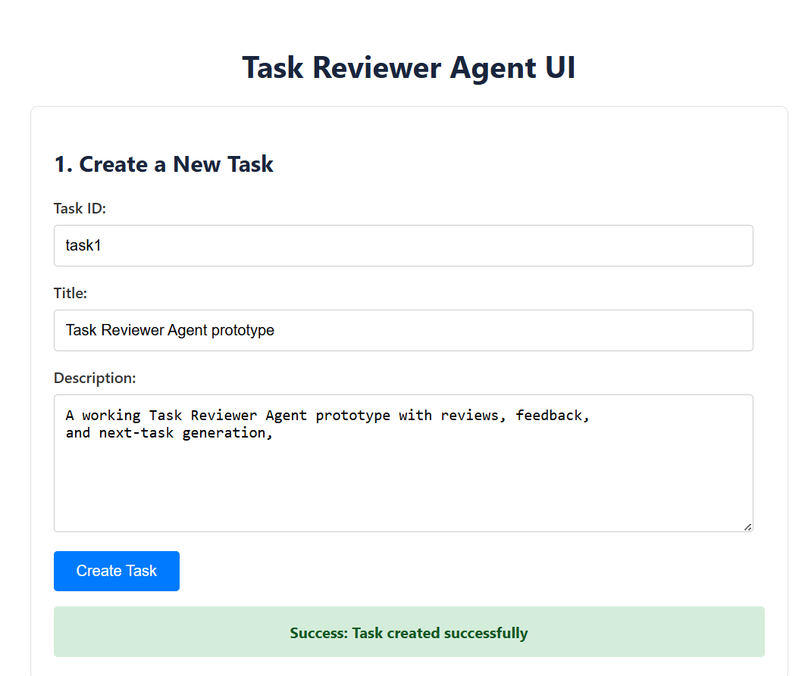
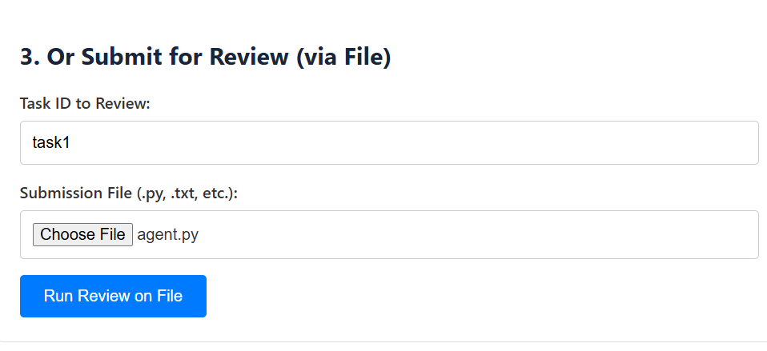
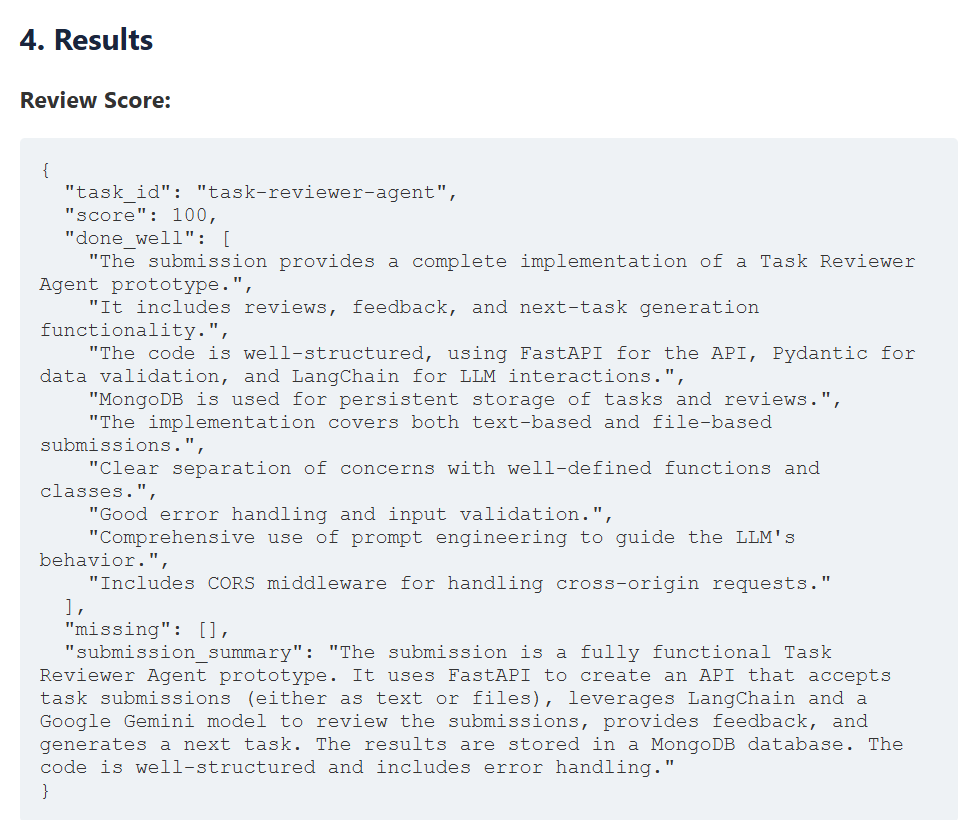
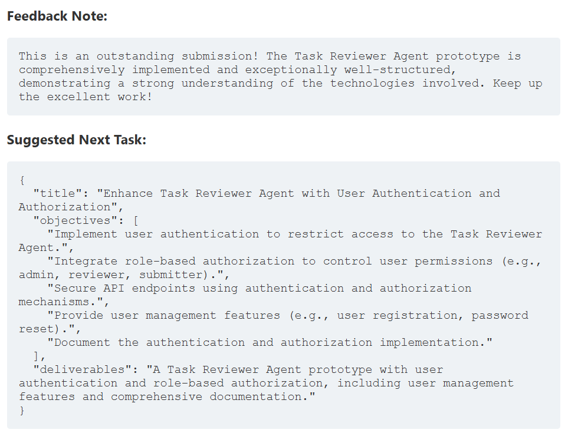
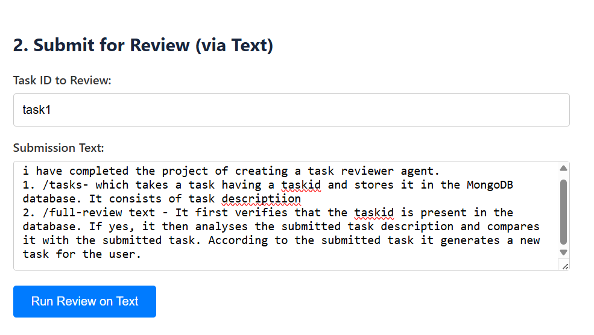
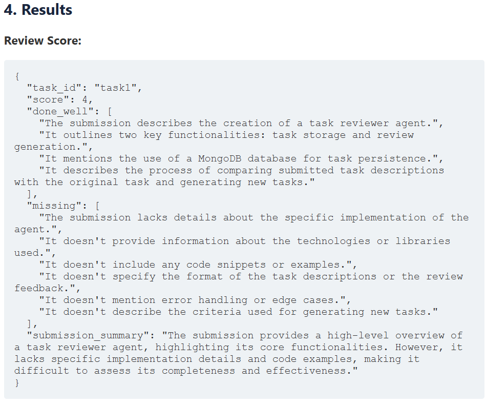
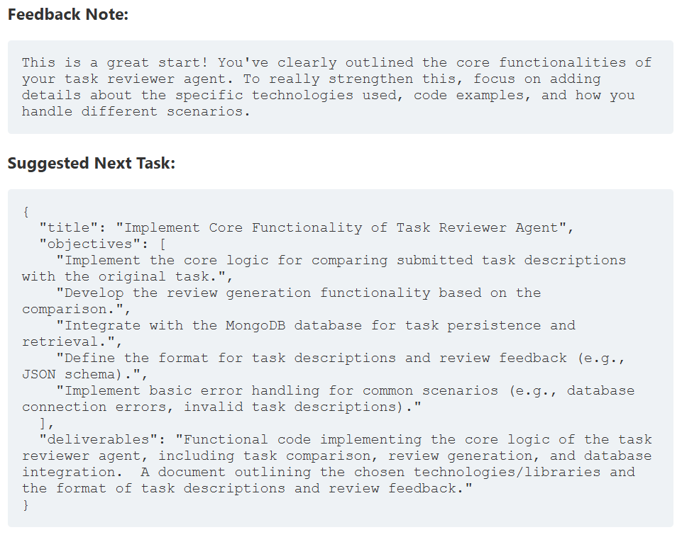

# Task Reviewer Agent - Project Demo

## Overview
This document demonstrates the end-to-end workflow of the Task Reviewer Agent, a full-stack Generative AI application. The agent can receive a task submission (either as text or a file), use an LLM to perform an intelligent review, generate human-friendly feedback, and create a logical follow-up task.

## Technology Stack
- **Backend**: FastAPI, Python
- **AI/LLM**: Google Gemini, LangChain (Chains, Prompt Templates, Pydantic Output Parsers)
- **Database**: MongoDB (with Pydantic for data modeling)
- **Frontend**: HTML, CSS, JavaScript

---

## Workflow Demo

### Step 1: Create a New Task

First, we use the UI to create a new task in the database via the `POST /tasks` endpoint.

**Input:**

### Step 2: Submit a Review to Analyse

Next, we use the UI to submit a review for the task we just created. This calls the `POST /full-review-text/{task_id}` endpoint.

**Input:**

### Step 3: View the Intelligent Results

The agent processes the submission and returns a complete package containing the structured review, a generated feedback note, and a suggested next task.

**Result:**

### Added another feature to submit a File for Full Review

Next, we use the UI to submit a review for a particular file. This calls the `POST /full-review-file/{task_id}` endpoint.

**Input:**

## Conclusion

The agent successfully performed a contextual review, generated relevant feedback, and created a new task, demonstrating a complete, intelligent, and automated workflow.

